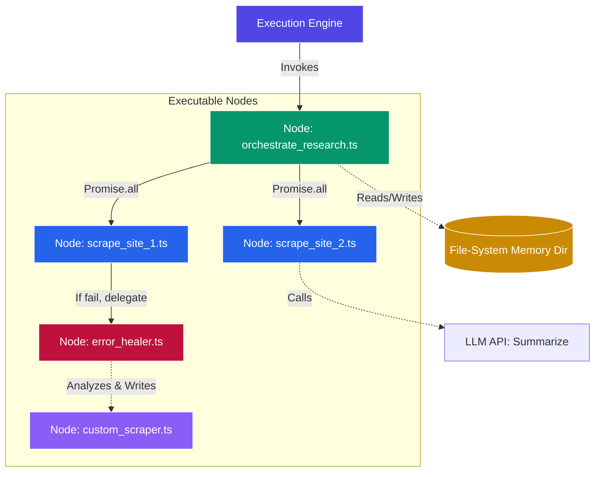

# Rachel 10: Polymorphic Agent Engine

The next evolution of AI agent architecture. Instead of a static harness trying to route a "chat assistant" through fixed tools, **everything is an executable TypeScript node**.

### The Core Philosophy
1. **Unified Nodes:** There is no difference between a "Tool" and a "Plan". They are both just composable `.ts` files executing in a native Bun environment.
2. **Implicit Multi-Agent:** Because plans are just async TypeScript, spawning multiple parallel agents is as simple as `Promise.all([runNode('A'), runNode('B')])`.
3. **Hierarchical FS Memory:** No databases. Memory is purely a hierarchical filesystem path (JSON/Markdown files nested in folders). Nodes read/write branches of this tree.
4. **Self-Healing at the Edge:** Errors are caught locally inside the node. The node can either handle it programmatically, or delegate the error to a specialized "Healer" node that writes new executable code to bypass the failure.

## Architecture

## Running the Engine
*(Implementation pending)*
The engine simply provides the runtime context (LLM compiler, Hierarchical Memory access, and Node Executor) and begins evaluating the root node.
